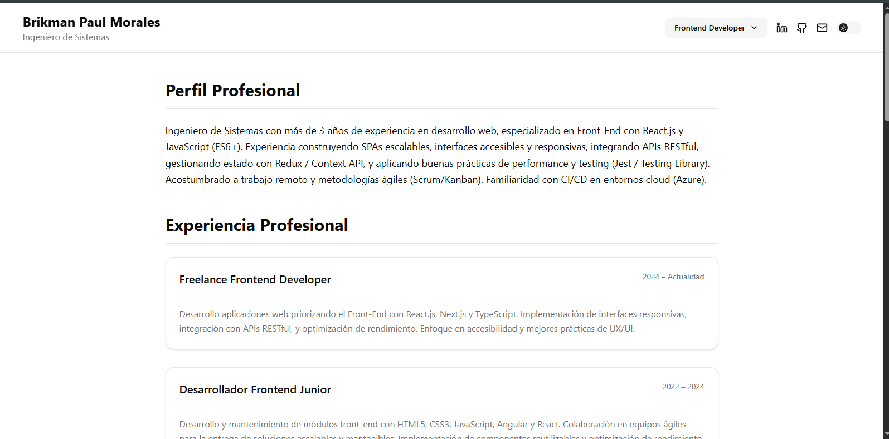

# CV Brikman Paul Morales



Este es un CV interactivo desarrollado por **Brikman Paul Morales**, Ingeniero de Sistemas y Full Stack Developer con más de 3 años de experiencia en desarrollo web.

## 🚀 Tecnologías utilizadas

- [Next.js 13+](https://nextjs.org/) (App Router)
- [React](https://react.dev/)
- [TypeScript](https://www.typescriptlang.org/)
- [Tailwind CSS](https://tailwindcss.com/)
- [Framer Motion](https://www.framer.com/motion/)
- [Lucide React Icons](https://lucide.dev/)
- [Vercel Analytics](https://vercel.com/analytics)
- Dark Mode integrado 🌙 / ☀️

## 🌓 Modo Oscuro / Claro

Este CV se adapta automáticamente al modo oscuro/claro del sistema o según lo configures manualmente.

## 📦 Instalación local

```bash
pnpm install
pnpm dev
